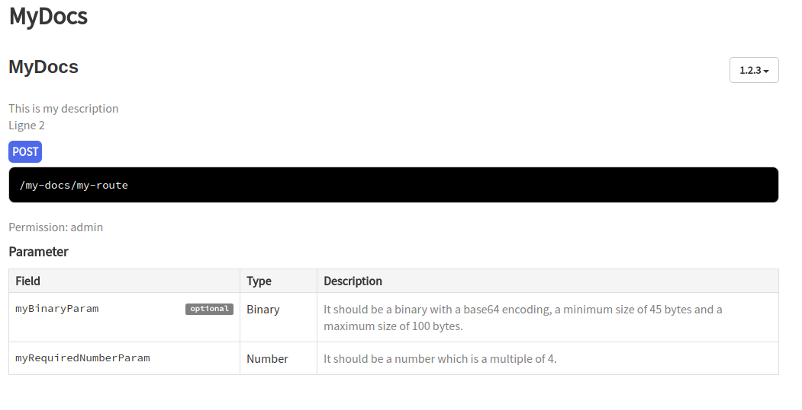

# Automatic doc generation

Koa-smart can automatically generate your application's documention for you, without the need for any additional code.
All you need to do is add the following option when you create your app:

```sh
  const app = new App({
    port: 3001,
    generateDoc: true, // indicates we want koa-smart to generate documentation
    docPath: join(__dirname, '..', 'apidoc'),
  });
```

From here, koa-smart will automatically create documentation the next time you launch your API.

For instance, if you write a route such as the following:

```sh
@Route.Post({
    accesses: [Route.admin],
    bodyType: Types.object().keys({
      myBinaryParam: Types.binary()
        .encoding('base64')
        .min(45)
        .max(100),
      myRequiredNumberParam: Types.number()
        .required()
        .multiple(4),
    }),
    doc: {
      version: '1.2.3' // format 'x.x.x'
      description: 'This is my description <br/> Ligne 2' // basic HTML can be used to format your custom route description
      },
  })
  async myRoute(ctx) {
    this.sendOk(ctx, this.body(ctx));
  }
}
```

the generated doc will look as such:


The parser will use the types given to the parameters in order to generate appropriate descriptions for each of them.
It should be noted the permissions's name will be the name of the functions passed to 'accesses'

## disabling doc generation

It is possible to exclude folders or individual routes from doc generation.

- For a folder, simply add the following option:

```sh
app.mountFolder('your/folder/path', '/path', {generateDoc: false});
```

- in the same manner, routes can be disabled as such:

```sh
  @Route.Post({
    bodyType,
    doc: { disable: true }, // no doc generation
  })
  async disableDoc(ctx) {
    this.sendOk(ctx, this.body(ctx));
  }
```
